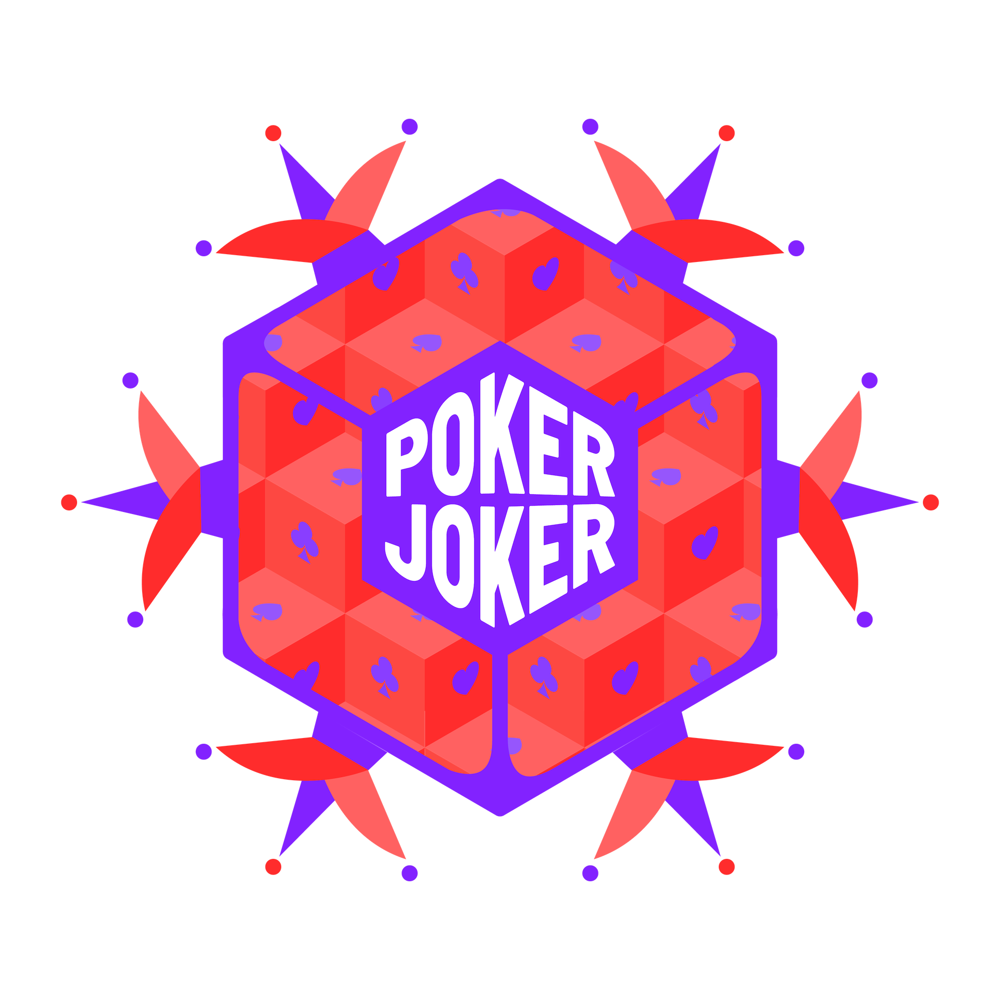

  

# Poker Joker DAO

Poker Joker DAO is a gaming DAO designed to manage games that provide ownership to players (DAO membership) and utilities for gaming assets (NFTs).

The current version is build for Hackatom VI.

In this version, we only support 1 game amd it is a multiplayer dice game implemented on the Secret Network.
The Secret Network allows for onchain randomness and privacy features that are unique to make this game possible.

## Design guidelines

We started off with wanting something fun and simple, and as we worked on the hackathon,
we realised that our design of the smart contracts was guided by a few principles that we value:

1. _Aligning NFT value with utility_: By linking the dice NFTs `xp` level (earned by playing) to the `base bet` amount,
   we providing a correlation between the NFT itself and the potential winnings (via [xp-table]) of an NFT in the game.
   This is important as it captures the skills of the previous owners of the NFT and encourages future engagement with the game.

2. _Easy onboarding for adoption_: We implemented collateralisation of Dice NFT so that first time users can play the game without specifically needing PJ Dao token (to be implemented) or network gas (with the incoming [feegrant] in the cosmos-sdk and other gas station implmentations).

3. _Decentralised gaming and governance_: As a Peer-to-Peer facility for gaming, this facilitates a fair chance for everyone to win (as opposed to casinos).
   Futhermore, the gamers should govern the organisation.
   For example, in this MVP, the DAO contract is currently responsible to mint and collateralisation of the NFTs.
   Such decisions, along with the scoring table will be voted by the gamers themselves.

[feegrant]: https://github.com/cosmos/cosmos-sdk/blob/v0.44.5/CHANGELOG.md#v0430---2021-08-10

---

## Game

Current this PJ DAO only supports 1 dice game played by nfts from 1 contract.

## Dice Game Rules

The players of the game roll their own sets of dice, which are represented by Secret NFTs (SNIP-721).
The owner of the dice NFT, depending on the attributes of the NFT, may have different privilledges in the game.

This is inspired by a mini game in the [Sea Dogs] game series.
It is similar, yet more simple than Poker dice.

[sea dogs]: https://www.gamepressure.com/games/sea-dogs-to-each-his-own/ze52a6

### Set up

- 5 Dice per player
- there is a base bet value per die in the game (set by the initiator, more on this later)
- each player lock fund in a pool `base bet * number of dice * 2`; `2` because each player can roll max all dice twice

### Play

- on each roll, fund is withdrawn from the players' pools to the stake
- each player takes turn to roll all 5 dice in their initial roll
- after each initiall roll, each player can reroll an arbitrary number of die/dices: _r_ (up to 5) once
- if the player decides to reroll
- after all players have had their initial (optional reroll), the player with the highest score wins
- any remaining funds in the pools are returned to the player
- all stake are transfered to the winner

#### Modes

There are two modes for play in Poker Joker, the clear and shielded mode (to be implemented).

- **Clear mode:** Using Secret Network Randomness feature - each player does their initial roll and the result of that roll can be observed by all the other players in the game.
- **Shielded mode (Coming Soon):** Using Secret Network Privacy feature - the other players cannot see what the shielded player have rolled but only that they have / have not rerolled. Naturally if a player is using the shielded mode, it is unlikely that an unshielded player will opt in to play.

#### Scoring

- _1 point:_ 1 pair
- _2 points:_ 2 pairs
- _3 points:_ 3 of a kind
- _4 points:_ 3 of a kind + 1 pair
- _4 points:_ 4 of a kind
- _4 points:_ straight (1-5)
- _5 points:_ 5 of 1s

#### Winning

The winner of the game takes all the stakes,
and their dice NFT will increase xp and thus allowing the owner to access different privilledges.

## Dice NFT levels

In order to align the value of the Dice NFT with their utility, we have initially set up some privilledges below:

1. **Base Bet**: The base bet of a game is set by any player, however, there is a maximum amount depending on the initiator's NFT `xp`. Please see [xp table] for details
2. **Shielded Game**: Player with the high `xp` NFT can play in the shielded mode

[xp table]: (#xp-table)

### XP Table

|   Point | Base Bet | Access to Shielded Game |
| ------: | -------: | ----------------------: |
|    < 10 |   1 Scrt |                      No |
| 10 < 20 |   2 Scrt |                      No |
| 20 < 40 |   4 Scrt |                     Yes |
|    40 + |   8 Scrt |                     Yes |

---

## Dice NFT

It is a fork of the SNIP-721 Reference Implementation

Added features:

- Collateralisation (can be used with the js-cli)
  - InitCollateral: Done by the owner setting the price, repayment price and expiration date
  - Collateralise: Someone taking this collateral off the market and can transfer it to themselves after expriation date
  - UnCollateralise: Either the token owner or the collateral holder calls this to make repayment or transfer toke (post expiration)
- Specific Poker Joker Game metadata (xp and colour generation)
- on chain randomness generation of some metadata (using entryopy from block time)

---

## Ideas to explore and hackint

- loser loses points
- make SNIP721 specs into a lib

  For more ideas, please see issues created in this repo.

Please go to [hack.md](./hack.md) to set up a local environment.
